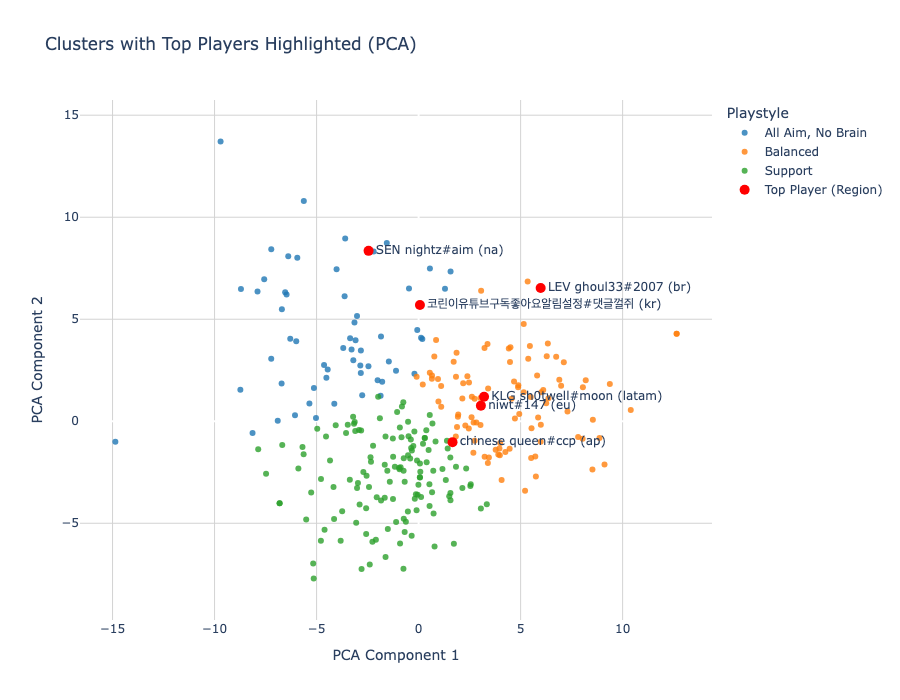
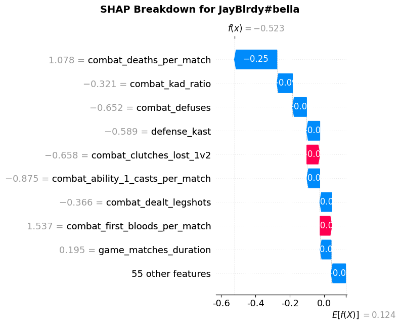

# How to Become a Ranked Demon 🧠🔫  
**Date:** April 22, 2025  

[:star: Link to Full Report :star:](https://docs.google.com/document/d/1Qrdyx5jzMtqn32rvckClQuJ1LXI0qutGdzD0igCW8xk/edit?usp=sharing)

## 📝 Summary

What separates the best VALORANT players from the rest of us? That’s the question I set out to answer in this data science project by analyzing match statistics from 292 of the top-ranked players across six competitive regions.

Using KMeans clustering and PCA, I identified three distinct playstyle archetypes among elite players: **"All Aim, No Brain"**, **"Support"**, and **"Balanced"**. Interestingly, most of my friends and I fell into the Support category — despite the data showing that more proactive, frag-heavy styles are more strongly associated with ranked success.

I trained multiple regression models to predict **rank rating (RR)** and **game win rate**, with **Ridge Regression** reaching an R² of 0.47 for RR, and **XGBoost** hitting 0.62 for win rate. Feature importance analysis using SHAP values revealed that less conventional metrics — like **1v2 clutches lost**, **match duration**, and **legshots dealt** — mattered more than classic stats like **headshot percentage**, **average damage**, or even **ACS**. That said, **KAST**, a go-to performance metric in pro-level analysis, proved to be one of the strongest predictors of win rate.

I also ran personalized SHAP analyses on myself and my friends to highlight individual strengths, weaknesses, and actionable takeaways — offering a small taste of how data can be used to level up your ranked game.

### Player Clusters by Playstyle (PCA)

### SHAP Breakdown: JayBlrdy#bella
